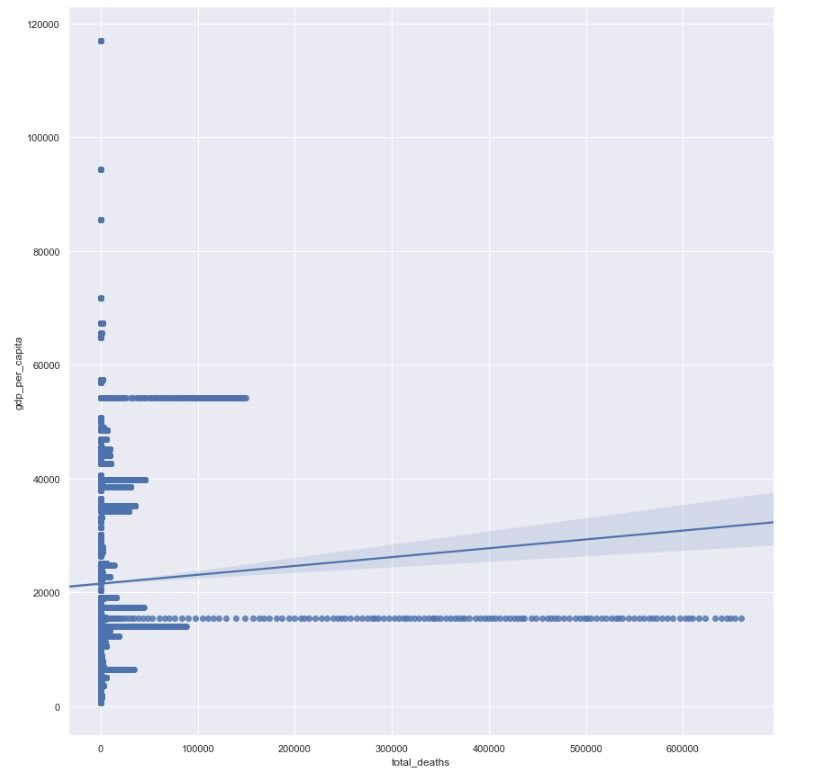

### Data Understanding

**Data Set Info**

There are 33417 observations and 34 columns where 5 variables are of categorical data type and the remaining 29 variables are of numerical data types. Looking at the column names, the data set provides us information about total number of COVID cases, tests and deaths by continent and by different age brackets. It also has information about per capita, life expectancy, death rate by cardiovascular and diabetes on a daily basis.
 

    RangeIndex: 33417 entries, 0 to 33416
    Data columns (total 34 columns):
    iso_code                           33353 non-null object
    continent                          33141 non-null object
    location                           33417 non-null object
    date                               33417 non-null object
    total_cases                        33062 non-null float64
    new_cases                          33062 non-null float64
    total_deaths                       33062 non-null float64
    new_deaths                         33062 non-null float64
    total_cases_per_million            32998 non-null float64
    new_cases_per_million              32998 non-null float64
    total_deaths_per_million           32998 non-null float64
    new_deaths_per_million             32998 non-null float64
    new_tests                          10401 non-null float64
    total_tests                        10647 non-null float64
    total_tests_per_thousand           10647 non-null float64
    new_tests_per_thousand             10401 non-null float64
    new_tests_smoothed                 11520 non-null float64
    new_tests_smoothed_per_thousand    11520 non-null float64
    tests_units                        12288 non-null object
    stringency_index                   27130 non-null float64
    population                         33353 non-null float64
    population_density                 31910 non-null float64
    median_age                         30074 non-null float64
    aged_65_older                      29638 non-null float64
    aged_70_older                      29919 non-null float64
    gdp_per_capita                     29708 non-null float64
    extreme_poverty                    19865 non-null float64
    cardiovasc_death_rate              30083 non-null float64
    diabetes_prevalence                31104 non-null float64
    female_smokers                     23877 non-null float64
    male_smokers                       23591 non-null float64
    handwashing_facilities             13764 non-null float64
    hospital_beds_per_thousand         27353 non-null float64
    life_expectancy                    32951 non-null float64
    dtypes: float64(29), object(5)
    memory usage: 8.7+ MB
 

**Description and Summary**
Below table shows the description and summary of numerical or continuous variables:
<table border="1" class="dataframe">
  <thead>
    <tr style="text-align: right;">
      <th></th>
      <th>total_cases</th>
      <th>new_cases</th>
      <th>total_deaths</th>
      <th>new_deaths</th>
      <th>total_cases_per_million</th>
      <th>new_cases_per_million</th>
      <th>total_deaths_per_million</th>
      <th>new_deaths_per_million</th>
      <th>new_tests</th>
      <th>total_tests</th>
      <th>total_tests_per_thousand</th>
      <th>new_tests_per_thousand</th>
      <th>new_tests_smoothed</th>
      <th>new_tests_smoothed_per_thousand</th>
      <th>stringency_index</th>
      <th>population</th>
      <th>population_density</th>
      <th>median_age</th>
      <th>aged_65_older</th>
      <th>aged_70_older</th>
      <th>gdp_per_capita</th>
      <th>extreme_poverty</th>
      <th>cardiovasc_death_rate</th>
      <th>diabetes_prevalence</th>
      <th>female_smokers</th>
      <th>male_smokers</th>
      <th>handwashing_facilities</th>
      <th>hospital_beds_per_thousand</th>
      <th>life_expectancy</th>
    </tr>
  </thead>
  <tbody>
    <tr>
      <th>count</th>
      <td>3.306200e+04</td>
      <td>33062.000000</td>
      <td>33062.000000</td>
      <td>33062.00000</td>
      <td>32998.000000</td>
      <td>32998.000000</td>
      <td>32998.000000</td>
      <td>32998.000000</td>
      <td>10401.000000</td>
      <td>1.064700e+04</td>
      <td>10647.000000</td>
      <td>10401.000000</td>
      <td>11520.000000</td>
      <td>11520.000000</td>
      <td>27130.000000</td>
      <td>3.335300e+04</td>
      <td>31910.000000</td>
      <td>30074.000000</td>
      <td>29638.000000</td>
      <td>29919.000000</td>
      <td>29708.000000</td>
      <td>19865.000000</td>
      <td>30083.000000</td>
      <td>31104.000000</td>
      <td>23877.000000</td>
      <td>23591.000000</td>
      <td>13764.000000</td>
      <td>27353.000000</td>
      <td>32951.000000</td>
    </tr>
    <tr>
      <th>mean</th>
      <td>5.091939e+04</td>
      <td>1010.762809</td>
      <td>2655.291634</td>
      <td>39.93243</td>
      <td>1103.657007</td>
      <td>17.858746</td>
      <td>40.909829</td>
      <td>0.533204</td>
      <td>16320.258341</td>
      <td>7.689958e+05</td>
      <td>30.980448</td>
      <td>0.572316</td>
      <td>15589.503906</td>
      <td>0.551412</td>
      <td>58.327987</td>
      <td>9.443562e+07</td>
      <td>368.561392</td>
      <td>31.634754</td>
      <td>9.450372</td>
      <td>5.990319</td>
      <td>21546.066343</td>
      <td>11.489011</td>
      <td>249.517591</td>
      <td>8.039533</td>
      <td>10.990606</td>
      <td>32.629508</td>
      <td>53.246010</td>
      <td>3.146980</td>
      <td>74.244388</td>
    </tr>
    <tr>
      <th>std</th>
      <td>5.180225e+05</td>
      <td>9309.139517</td>
      <td>25233.329557</td>
      <td>347.73264</td>
      <td>2674.940362</td>
      <td>62.928423</td>
      <td>123.250689</td>
      <td>3.006846</td>
      <td>59168.420750</td>
      <td>3.022411e+06</td>
      <td>55.964699</td>
      <td>1.104416</td>
      <td>54168.666654</td>
      <td>0.979232</td>
      <td>29.773501</td>
      <td>6.370159e+08</td>
      <td>1680.063490</td>
      <td>9.012636</td>
      <td>6.375376</td>
      <td>4.362110</td>
      <td>20697.420278</td>
      <td>18.736936</td>
      <td>117.957827</td>
      <td>4.116805</td>
      <td>10.504692</td>
      <td>13.328649</td>
      <td>31.456423</td>
      <td>2.549325</td>
      <td>7.316460</td>
    </tr>
    <tr>
      <th>min</th>
      <td>0.000000e+00</td>
      <td>-29726.000000</td>
      <td>0.000000</td>
      <td>-1918.00000</td>
      <td>0.000000</td>
      <td>-437.881000</td>
      <td>0.000000</td>
      <td>-41.023000</td>
      <td>-3743.000000</td>
      <td>1.000000e+00</td>
      <td>0.000000</td>
      <td>-0.398000</td>
      <td>0.000000</td>
      <td>0.000000</td>
      <td>0.000000</td>
      <td>8.090000e+02</td>
      <td>0.137000</td>
      <td>15.100000</td>
      <td>1.144000</td>
      <td>0.526000</td>
      <td>661.240000</td>
      <td>0.100000</td>
      <td>79.370000</td>
      <td>0.990000</td>
      <td>0.100000</td>
      <td>7.700000</td>
      <td>1.188000</td>
      <td>0.100000</td>
      <td>53.280000</td>
    </tr>
    <tr>
      <th>25%</th>
      <td>2.100000e+01</td>
      <td>0.000000</td>
      <td>0.000000</td>
      <td>0.00000</td>
      <td>8.521500</td>
      <td>0.000000</td>
      <td>0.000000</td>
      <td>0.000000</td>
      <td>805.000000</td>
      <td>2.585100e+04</td>
      <td>1.437000</td>
      <td>0.049000</td>
      <td>903.000000</td>
      <td>0.051000</td>
      <td>37.960000</td>
      <td>1.701583e+06</td>
      <td>39.497000</td>
      <td>24.400000</td>
      <td>3.607000</td>
      <td>2.162000</td>
      <td>6171.884000</td>
      <td>0.500000</td>
      <td>153.493000</td>
      <td>5.310000</td>
      <td>1.900000</td>
      <td>21.400000</td>
      <td>22.863000</td>
      <td>1.380000</td>
      <td>70.390000</td>
    </tr>
    <tr>
      <th>50%</th>
      <td>4.460000e+02</td>
      <td>5.000000</td>
      <td>9.000000</td>
      <td>0.00000</td>
      <td>155.458000</td>
      <td>0.773000</td>
      <td>2.043000</td>
      <td>0.000000</td>
      <td>2766.000000</td>
      <td>1.105140e+05</td>
      <td>8.105000</td>
      <td>0.221000</td>
      <td>3115.000000</td>
      <td>0.239000</td>
      <td>67.590000</td>
      <td>8.655541e+06</td>
      <td>90.672000</td>
      <td>31.800000</td>
      <td>7.104000</td>
      <td>4.458000</td>
      <td>15183.616000</td>
      <td>1.700000</td>
      <td>235.954000</td>
      <td>7.110000</td>
      <td>6.434000</td>
      <td>31.400000</td>
      <td>55.182000</td>
      <td>2.540000</td>
      <td>75.860000</td>
    </tr>
    <tr>
      <th>75%</th>
      <td>5.066500e+03</td>
      <td>102.000000</td>
      <td>107.000000</td>
      <td>2.00000</td>
      <td>936.628000</td>
      <td>10.572000</td>
      <td>21.692000</td>
      <td>0.140000</td>
      <td>9307.000000</td>
      <td>4.324700e+05</td>
      <td>38.056000</td>
      <td>0.693000</td>
      <td>9528.250000</td>
      <td>0.691000</td>
      <td>81.940000</td>
      <td>3.236600e+07</td>
      <td>222.873000</td>
      <td>39.800000</td>
      <td>14.864000</td>
      <td>9.720000</td>
      <td>33132.320000</td>
      <td>15.000000</td>
      <td>318.949000</td>
      <td>10.080000</td>
      <td>19.600000</td>
      <td>40.900000</td>
      <td>83.741000</td>
      <td>4.210000</td>
      <td>80.100000</td>
    </tr>
    <tr>
      <th>max</th>
      <td>1.670892e+07</td>
      <td>284710.000000</td>
      <td>660123.000000</td>
      <td>10512.00000</td>
      <td>38138.741000</td>
      <td>4944.376000</td>
      <td>1237.551000</td>
      <td>200.040000</td>
      <td>929838.000000</td>
      <td>5.063568e+07</td>
      <td>638.167000</td>
      <td>20.611000</td>
      <td>801014.000000</td>
      <td>15.456000</td>
      <td>100.000000</td>
      <td>7.794799e+09</td>
      <td>19347.500000</td>
      <td>48.200000</td>
      <td>27.049000</td>
      <td>18.493000</td>
      <td>116935.600000</td>
      <td>77.600000</td>
      <td>724.417000</td>
      <td>23.360000</td>
      <td>44.000000</td>
      <td>78.100000</td>
      <td>98.999000</td>
      <td>13.800000</td>
      <td>86.750000</td>
    </tr>
  </tbody>
</table>

**GDP vs Total Deaths**
To get an initial understanding we created an lmplot to understand any relation between GDP and total deaths and observed that the total deaths are more for poorer countries but we cannot be very sure, as there is a spike very close to 60,000 which can be deemed as countries with higher GDP. A significant portion of deaths are still in the lesser GDP range which might indicate a disparity between life expectancy between richer and poorer countries.

