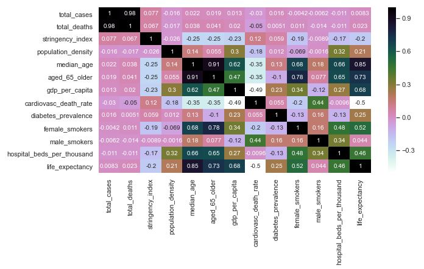
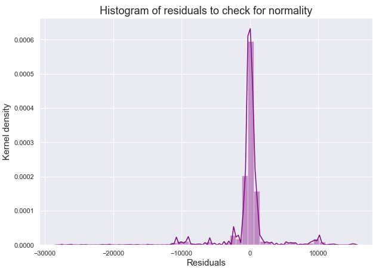
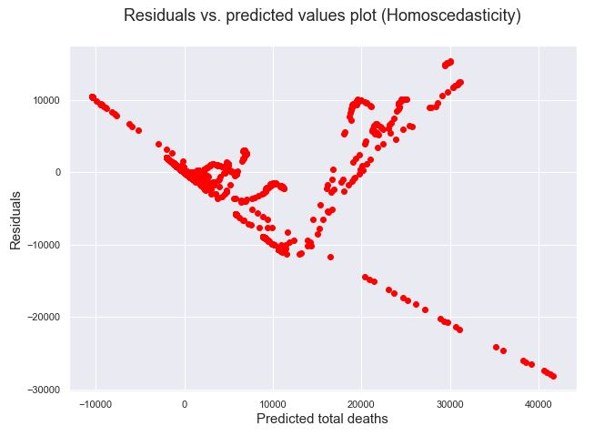

### Machine Learning

#### Heatmap for the Correlation Matrix
This heatmap shows the correlation between the different categories. This allows us to see how the different categories may effect each other. We can observe that median_age, aged_65_older and aged_70_older are correlated. We will include only median_age and aged_65_older in our model to avoid noise.

#### Linear Regression
We performed a linear regression on our EU data frame to understand the impact of GDP, demographic factors like age, prevalence of smoking, life expectancy, median age, location total cases.
	`The intercept term of the linear model: 2243.888492529553`

Linear Regression Coefficients are as below:

<table border="1" class="dataframe">
  <thead>
    <tr style="text-align: right;">
      <th></th>
      <th>Coefficients</th>
    </tr>
  </thead>
  <tbody>
    <tr>
      <th>total_cases</th>
      <td>4.388124e+03</td>
    </tr>
    <tr>
      <th>stringency_index</th>
      <td>4.041565e+02</td>
    </tr>
    <tr>
      <th>population_density</th>
      <td>-7.639171e+15</td>
    </tr>
    <tr>
      <th>median_age</th>
      <td>1.145649e+16</td>
    </tr>
    <tr>
      <th>aged_65_older</th>
      <td>-9.617242e+15</td>
    </tr>
    <tr>
      <th>gdp_per_capita</th>
      <td>2.845609e+16</td>
    </tr>
    <tr>
      <th>cardiovasc_death_rate</th>
      <td>2.546675e+16</td>
    </tr>
    <tr>
      <th>diabetes_prevalence</th>
      <td>1.111645e+16</td>
    </tr>
    <tr>
      <th>female_smokers</th>
      <td>1.107000e+16</td>
    </tr>
    <tr>
      <th>male_smokers</th>
      <td>4.598792e+15</td>
    </tr>
    <tr>
      <th>hospital_beds_per_thousand</th>
      <td>2.914445e+16</td>
    </tr>
    <tr>
      <th>life_expectancy</th>
      <td>-2.018291e+16</td>
    </tr>
    <tr>
      <th>iso_code_AND</th>
      <td>1.677666e+16</td>
    </tr>
    <tr>
      <th>iso_code_AUT</th>
      <td>1.008480e+16</td>
    </tr>
    <tr>
      <th>iso_code_BEL</th>
      <td>-2.479658e+16</td>
    </tr>
    <tr>
      <th>iso_code_BGR</th>
      <td>-1.401767e+16</td>
    </tr>
    <tr>
      <th>iso_code_BIH</th>
      <td>-3.326751e+16</td>
    </tr>
    <tr>
      <th>iso_code_BLR</th>
      <td>-2.110048e+16</td>
    </tr>
    <tr>
      <th>iso_code_CHE</th>
      <td>-3.052661e+15</td>
    </tr>
    <tr>
      <th>iso_code_CYP</th>
      <td>-1.225351e+16</td>
    </tr>
    <tr>
      <th>iso_code_CZE</th>
      <td>-1.263972e+15</td>
    </tr>
    <tr>
      <th>iso_code_DEU</th>
      <td>7.723661e+15</td>
    </tr>
    <tr>
      <th>iso_code_DNK</th>
      <td>2.689768e+16</td>
    </tr>
    <tr>
      <th>iso_code_ESP</th>
      <td>2.775221e+15</td>
    </tr>
    <tr>
      <th>iso_code_EST</th>
      <td>4.449207e+15</td>
    </tr>
    <tr>
      <th>iso_code_FIN</th>
      <td>6.387662e+15</td>
    </tr>
    <tr>
      <th>iso_code_FRA</th>
      <td>5.909560e+16</td>
    </tr>
    <tr>
      <th>iso_code_FRO</th>
      <td>1.350117e+16</td>
    </tr>
    <tr>
      <th>iso_code_GBR</th>
      <td>1.100902e+16</td>
    </tr>
    <tr>
      <th>iso_code_GGY</th>
      <td>-1.286488e+16</td>
    </tr>
    <tr>
      <th>iso_code_GIB</th>
      <td>1.040587e+16</td>
    </tr>
    <tr>
      <th>iso_code_GRC</th>
      <td>-6.008871e+14</td>
    </tr>
    <tr>
      <th>iso_code_HRV</th>
      <td>-9.216104e+15</td>
    </tr>
    <tr>
      <th>iso_code_HUN</th>
      <td>-1.994166e+16</td>
    </tr>
    <tr>
      <th>iso_code_IMN</th>
      <td>1.659487e+16</td>
    </tr>
    <tr>
      <th>iso_code_IRL</th>
      <td>-1.119291e+16</td>
    </tr>
    <tr>
      <th>iso_code_ISL</th>
      <td>6.475450e+15</td>
    </tr>
    <tr>
      <th>iso_code_ITA</th>
      <td>-2.739907e+16</td>
    </tr>
    <tr>
      <th>iso_code_JEY</th>
      <td>3.690339e+15</td>
    </tr>
    <tr>
      <th>iso_code_LIE</th>
      <td>3.272328e+14</td>
    </tr>
    <tr>
      <th>iso_code_LTU</th>
      <td>-1.701523e+16</td>
    </tr>
    <tr>
      <th>iso_code_LUX</th>
      <td>-2.166666e+16</td>
    </tr>
    <tr>
      <th>iso_code_LVA</th>
      <td>5.074342e+15</td>
    </tr>
    <tr>
      <th>iso_code_MCO</th>
      <td>1.041756e+15</td>
    </tr>
    <tr>
      <th>iso_code_MDA</th>
      <td>-1.326413e+16</td>
    </tr>
    <tr>
      <th>iso_code_MKD</th>
      <td>-1.458366e+16</td>
    </tr>
    <tr>
      <th>iso_code_MLT</th>
      <td>5.813585e+15</td>
    </tr>
    <tr>
      <th>iso_code_MNE</th>
      <td>-2.075621e+16</td>
    </tr>
    <tr>
      <th>iso_code_NLD</th>
      <td>-2.445927e+16</td>
    </tr>
    <tr>
      <th>iso_code_NOR</th>
      <td>-6.922632e+15</td>
    </tr>
    <tr>
      <th>iso_code_OWID_KOS</th>
      <td>-2.415548e+16</td>
    </tr>
    <tr>
      <th>iso_code_POL</th>
      <td>-2.412902e+16</td>
    </tr>
    <tr>
      <th>iso_code_PRT</th>
      <td>-2.519373e+16</td>
    </tr>
    <tr>
      <th>iso_code_ROU</th>
      <td>-2.036722e+15</td>
    </tr>
    <tr>
      <th>iso_code_RUS</th>
      <td>-2.596940e+16</td>
    </tr>
    <tr>
      <th>iso_code_SMR</th>
      <td>3.837194e+16</td>
    </tr>
    <tr>
      <th>iso_code_SRB</th>
      <td>-1.672350e+16</td>
    </tr>
    <tr>
      <th>iso_code_SVK</th>
      <td>1.518220e+15</td>
    </tr>
    <tr>
      <th>iso_code_SVN</th>
      <td>-1.782923e+16</td>
    </tr>
    <tr>
      <th>iso_code_SWE</th>
      <td>3.207623e+15</td>
    </tr>
    <tr>
      <th>iso_code_UKR</th>
      <td>-9.536771e+14</td>
    </tr>
    <tr>
      <th>iso_code_VAT</th>
      <td>-2.010495e+15</td>
    </tr>
    <tr>
      <th>location_Andorra</th>
      <td>-1.694448e+16</td>
    </tr>
    <tr>
      <th>location_Austria</th>
      <td>-2.107024e+16</td>
    </tr>
    <tr>
      <th>location_Belarus</th>
      <td>-7.335600e+14</td>
    </tr>
    <tr>
      <th>location_Belgium</th>
      <td>2.307448e+16</td>
    </tr>
    <tr>
      <th>location_Bosnia and Herzegovina</th>
      <td>2.486882e+16</td>
    </tr>
    <tr>
      <th>location_Bulgaria</th>
      <td>-1.359825e+15</td>
    </tr>
    <tr>
      <th>location_Croatia</th>
      <td>1.383471e+14</td>
    </tr>
    <tr>
      <th>location_Cyprus</th>
      <td>1.179733e+16</td>
    </tr>
    <tr>
      <th>location_Czech Republic</th>
      <td>-1.031157e+16</td>
    </tr>
    <tr>
      <th>location_Denmark</th>
      <td>-2.350112e+16</td>
    </tr>
    <tr>
      <th>location_Estonia</th>
      <td>-8.848710e+15</td>
    </tr>
    <tr>
      <th>location_Faeroe Islands</th>
      <td>-1.403089e+16</td>
    </tr>
    <tr>
      <th>location_Finland</th>
      <td>-2.233834e+15</td>
    </tr>
    <tr>
      <th>location_France</th>
      <td>-6.015327e+16</td>
    </tr>
    <tr>
      <th>location_Germany</th>
      <td>-2.255030e+16</td>
    </tr>
    <tr>
      <th>location_Gibraltar</th>
      <td>-1.034263e+16</td>
    </tr>
    <tr>
      <th>location_Greece</th>
      <td>-1.232976e+15</td>
    </tr>
    <tr>
      <th>location_Guernsey</th>
      <td>1.283442e+16</td>
    </tr>
    <tr>
      <th>location_Hungary</th>
      <td>7.394707e+15</td>
    </tr>
    <tr>
      <th>location_Iceland</th>
      <td>1.260433e+15</td>
    </tr>
    <tr>
      <th>location_Ireland</th>
      <td>9.888678e+15</td>
    </tr>
    <tr>
      <th>location_Isle of Man</th>
      <td>-1.655653e+16</td>
    </tr>
    <tr>
      <th>location_Italy</th>
      <td>3.329812e+16</td>
    </tr>
    <tr>
      <th>location_Jersey</th>
      <td>-3.721587e+15</td>
    </tr>
    <tr>
      <th>location_Kosovo</th>
      <td>2.901669e+16</td>
    </tr>
    <tr>
      <th>location_Latvia</th>
      <td>-1.650324e+16</td>
    </tr>
    <tr>
      <th>location_Liechtenstein</th>
      <td>2.428077e+15</td>
    </tr>
    <tr>
      <th>location_Lithuania</th>
      <td>3.960924e+15</td>
    </tr>
    <tr>
      <th>location_Luxembourg</th>
      <td>9.274371e+15</td>
    </tr>
    <tr>
      <th>location_Macedonia</th>
      <td>5.159152e+15</td>
    </tr>
    <tr>
      <th>location_Malta</th>
      <td>-7.060992e+15</td>
    </tr>
    <tr>
      <th>location_Moldova</th>
      <td>5.215677e+15</td>
    </tr>
    <tr>
      <th>location_Monaco</th>
      <td>-5.972042e+15</td>
    </tr>
    <tr>
      <th>location_Montenegro</th>
      <td>7.535881e+15</td>
    </tr>
    <tr>
      <th>location_Netherlands</th>
      <td>2.518425e+16</td>
    </tr>
    <tr>
      <th>location_Norway</th>
      <td>5.814110e+15</td>
    </tr>
    <tr>
      <th>location_Poland</th>
      <td>1.731636e+16</td>
    </tr>
    <tr>
      <th>location_Portugal</th>
      <td>2.693640e+16</td>
    </tr>
    <tr>
      <th>location_Romania</th>
      <td>-1.710978e+16</td>
    </tr>
    <tr>
      <th>location_Russia</th>
      <td>2.001379e+15</td>
    </tr>
    <tr>
      <th>location_San Marino</th>
      <td>-3.982231e+16</td>
    </tr>
    <tr>
      <th>location_Serbia</th>
      <td>-4.298116e+14</td>
    </tr>
    <tr>
      <th>location_Slovakia</th>
      <td>-1.209923e+16</td>
    </tr>
    <tr>
      <th>location_Slovenia</th>
      <td>1.704641e+16</td>
    </tr>
    <tr>
      <th>location_Spain</th>
      <td>-4.683184e+14</td>
    </tr>
    <tr>
      <th>location_Sweden</th>
      <td>3.958107e+15</td>
    </tr>
    <tr>
      <th>location_Switzerland</th>
      <td>5.861035e+14</td>
    </tr>
    <tr>
      <th>location_Ukraine</th>
      <td>-1.873240e+16</td>
    </tr>
    <tr>
      <th>location_United Kingdom</th>
      <td>-3.976763e+15</td>
    </tr>
    <tr>
      <th>location_Vatican</th>
      <td>-2.218792e+15</td>
    </tr>
  </tbody>
</table>

The model accuracy comes as 70.5%  from this, we can also get the intercept and the coefficients.  To check if this model we plotted the residuals for normality and residuals versus predicted for homoscedasticity.

Below plot shows us that the residuals though might seem like normally distributed but narrower plot are not normally distributed.

From below residuals vs predicted plot we can observe that this data set is not good for a linear regression model.

